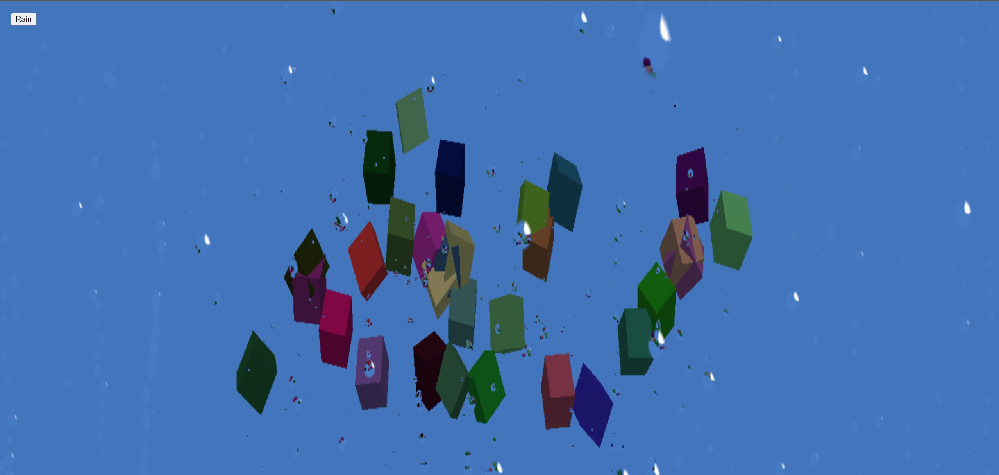

# Three-skinnedmesh-emiter

Three.js experiment to create waterdrop on camera

## Description

This project show how to setup a custom material using [three.js](https://threejs.org/).

You can control the camera using mouse. 

## Youtube video

Check the [video](https://youtu.be/yWNqlnp4yNs) on youtube.
